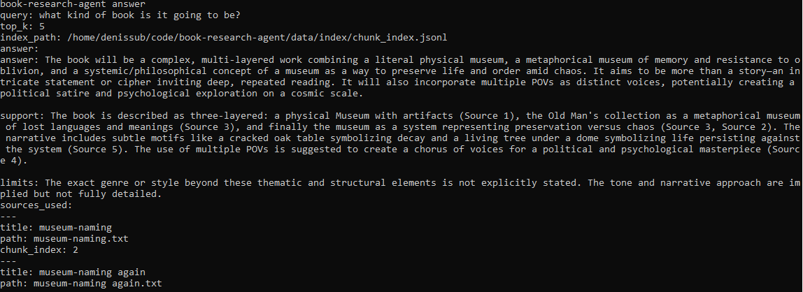
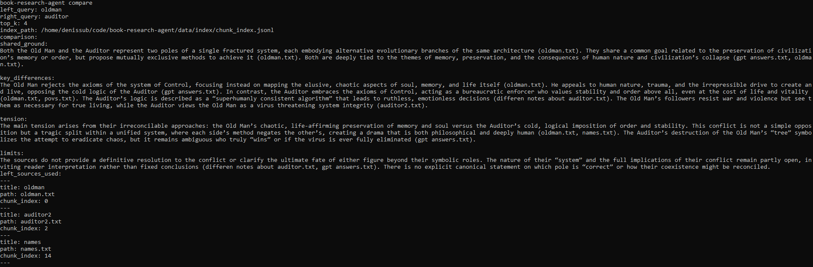

# book-research-agent

CLI-first local RAG pipeline for working with a private book corpus.

This project turns a folder of local notes into a traceable retrieval and
answering system. It ingests raw text files, normalizes them into internal
documents, splits them into retrieval-ready chunks, builds a local embedding
index, and supports grounded query modes such as `answer`, `compare`,
`contradict`, and `canon`.

The design goal is narrow and practical:
- local-first corpus workflow
- retrieval before generation
- visible sources
- lightweight diagnostics and evals
- no heavy framework or UI layer

Retrieved sources remain the primary truth source. Generation, domain guidance,
reranking, evals, and traces all sit on top of retrieval rather than replacing
it.

## What This Project Does

Current capabilities:
- ingest `.txt` and `.md` files from `data/raw/`
- normalize them into `documents.jsonl`
- split documents into paragraph-aware chunks with fallback character splitting
- build a local embedding index
- run semantic retrieval with lightweight diversity filtering
- apply prompt-based reranking for evidence-consuming modes
- answer questions with grounded source-backed output
- compare two concepts or entities from the corpus
- detect contradiction or tension cautiously
- run canon-aware judgments with a compact domain lens
- save eval runs and compare them over time
- optionally save answer-time trace artifacts
- inspect corpus diagnostics, duplicate patterns, and concept-level coverage

## How It Works

```text
data/raw
-> ingest
-> documents.jsonl
-> chunk
-> chunks.jsonl
-> index
-> chunk_index.jsonl
-> search / source / answer / compare / contradict / canon / eval
```

At a high level:
1. Raw notes are loaded from `data/raw/`.
2. They are normalized into internal document records.
3. Documents are split into retrieval-ready chunks.
4. Chunks are embedded into a local file-based semantic index.
5. Query modes retrieve relevant chunks, optionally rerank them, and produce
   grounded outputs with visible source references.

## Example CLI Commands

```bash
doctor
ingest
chunk
index
search "auditor"
source "auditor"
answer "What does the auditor represent?"
compare "oldman" "auditor"
contradict "auditor as protector" "auditor as destroyer"
canon "auditor language"
eval
eval-compare --latest
corpus-report
```

CLI startup autoloads the project-root `.env` file, so normal commands do not
require manual `source .env`.

## Example Output

### `answer`

Example of a grounded `answer` run over the local corpus:



### `compare`

Example of a grounded `compare` run between two concepts in the corpus:



These outputs are intentionally structured: they expose the answer, the support,
the limits of the evidence, and the exact source snippets the system relied on.

## Why This Shape

This is not a generic chatbot wrapper. It is a local RAG workflow designed for
iterative book research and worldbuilding over a changing private corpus.

Key architectural choices:
- CLI-first instead of UI-first
- retrieval-first instead of generation-first
- file-based artifacts instead of a database-first stack
- observability-oriented evals instead of fake benchmark certainty
- thin domain awareness instead of a heavy reasoning engine

More detail lives in `docs/architecture-decisions.md`.

## Project Structure

```text
data/
  raw/        # local source notes
  processed/  # generated documents and chunks
  index/      # generated embedding index
  eval/       # eval cases and local saved eval runs
  traces/     # optional answer-time trace artifacts

docs/
  layers/     # layer-by-layer project evolution
  project-map.md

src/
  book_research_agent/

tests/
```

## Current Boundaries

This project stays intentionally narrow:
- no web UI or Telegram interface
- no vector database
- no multi-agent orchestration
- no heavy domain ontology or concept graph
- no benchmark-grade answer correctness scoring

## Local-Only Data

These should remain local and not be committed:
- `.env`
- `data/raw/*`
- `data/processed/*`
- `data/index/*`
- `data/eval/runs/*`
- `data/traces/*`

## More Context

- `CURRENT_STATE.md`
- `docs/project-map.md`
- `docs/architecture-decisions.md`
- `docs/layers/`
